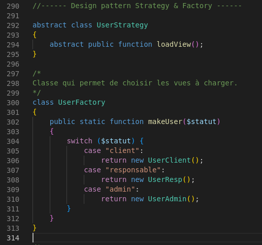
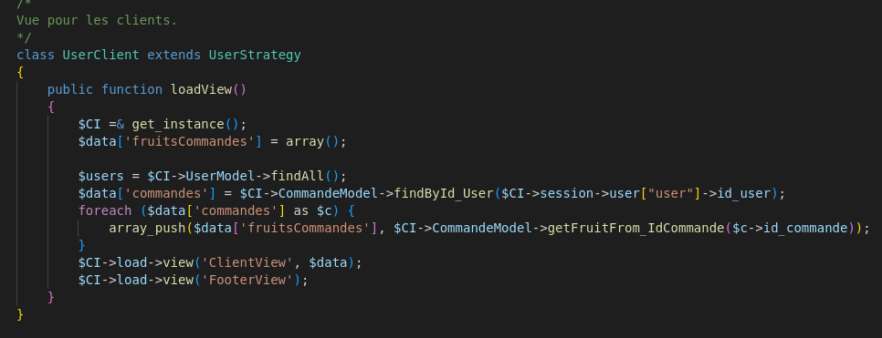

# **SAE R3.04 - Patrons de conceptions**
### **_Groupe 2-1_**
### _Mathieu Bergeron, Tom Freret, Sylvain Baudouin, Tomás Martineau, Fabien Nicou_

## **_Factory_**

Le patron de conception **"Factory"** est utilisé dans cet exemple avec la classe UserFactory, qui est une classe abstraite (déclarée avec le mot-clé abstract). La classe UserFactory définit une méthode abstraite makeUser() qui prend en paramètre un statut et renvoie un objet de type User.

Ce patron de conception permet de centraliser la logique de création des objets dans une seule et même classe (ici UserFactory), ce qui peut être utile lorsque la création de ces objets est complexe ou nécessite de nombreuses étapes. Cela permet également de rendre le code plus facile à maintenir et à modifier, car toutes les modifications à apporter à la création des objets peuvent être effectuées dans une seule et même classe.

## **_Strategy_**

Le patron de conception **"Strategy"** est également utilisé dans cet exemple, avec la classe abstraite UserStrategy qui définit une méthode abstraite loadView(). Les classes UserClient, UserResp et UserAdmin héritent de UserStrategy et définissent chacune leur propre implémentation de la méthode loadView().

Ce patron de conception permet de définir une stratégie de traitement pour chaque type d'objet (ici chaque type d'utilisateur), en encapsulant cette stratégie dans une classe dédiée. Cela permet de rendre le code plus modulaire et flexible, car il est possible de changer de stratégie de traitement en modifiant simplement la classe utilisée, sans avoir à modifier le reste du code.

## **_Decorator_**

Le patron de conception **"Decorator"** est utilisé dans cet exemple avec la classe abstraite FruitDecorator qui étend la classe FruitEntity (déclarée avec le mot-clé extends). La classe FruitDecorator sert de classe de base pour les classes FruitQuantity et FruitCommande, qui héritent de cette classe.

Le patron de conception "Decorator" permet de ajouter de nouvelles responsabilités à un objet de manière transparente, en enveloppant l'objet dans un autre objet qui possède ces responsabilités supplémentaires. Dans cet exemple, la classe FruitDecorator ajoute la responsabilité de stocker une quantité de fruits et un identifiant de commande à l'objet FruitEntity.

Les classes FruitQuantity et FruitCommande sont des exemples de classes "decorators" qui héritent de FruitDecorator et ajoutent ces responsabilités à l'objet FruitEntity. La classe FruitQuantity ajoute simplement la responsabilité de stocker une quantité de fruits, tandis que la classe FruitCommande ajoute également la responsabilité de stocker un identifiant de commande.

Le patron de conception "Decorator" permet de rendre le code plus modulaire et flexible, car il est possible d'ajouter de nouvelles responsabilités à un objet sans avoir à en modifier la classe de base. Cela peut être utile lorsque vous avez besoin d'ajouter de nouvelles fonctionnalités à un objet de manière dynamique, sans avoir à créer de nouvelles classes pour chaque combinaison de responsabilités.