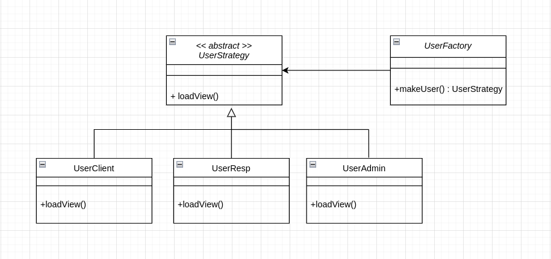
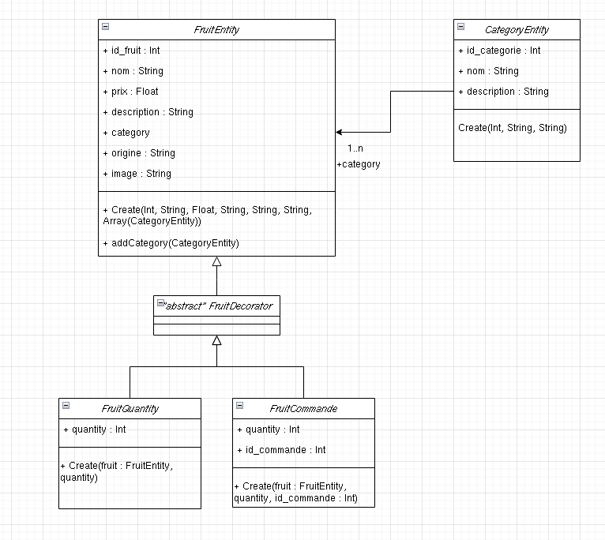

# **SAE R3.04 - Patrons de conceptions**
### **_Groupe 2-1_**
### _Mathieu Bergeron, Tom Freret, Sylvain Baudouin, Tomás Martineau, Fabien Nicou_


## **_Factory - Strategy_**

### **_C'est quoi ?_**

Un design pattern Strategy est un patron de conception qui permet de définir une famille d'algorithmes, encapsuler chacun d'entre eux et les rendre interchangeable. Cela permet de changer l'algorithme utilisé sans avoir à changer le reste du code. 

Lorsqu'il est combiné avec le design pattern Factory, cela permet de créer des objets en utilisant des algorithmes différents en fonction des besoins spécifiques de l'application. La Factory crée les objets en utilisant les algorithmes appropriés, tandis que le Strategy définit les algorithmes eux-mêmes. En utilisant ces deux patrons ensemble, il est possible de créer des systèmes flexibles et évolutifs qui peuvent facilement gérer différents types d'algorithmes et de données.




_Schéma UML réprésentant les design paterns factory et strategy_

### **_Pourquoi on les utilise ?_** 

Dans notre contexte, les design patterns Strategy et Factory sont utilisés pour gérer les vues qui sont chargées en fonction du statut d'utilisateur (client, responsable, admin). 

Ainsi, en utilisant ces deux patrons de conception ensemble, il est possible de facilement ajouter ou supprimer des vues ou des statuts d'utilisateur sans avoir à modifier les parties du code qui dépendent de ces vues ou de ces statuts. Le code est également plus facile à maintenir et plus extensible.


```php
abstract class UserStrategy
{
    abstract public function loadView();
}

/*
Classe qui permet de choisir les vues à charger.
*/
class UserFactory
{
    public static function makeUser($statut)
    {
        switch ($statut) {
            case "client":
                return new UserClient();
            case "responsable":
                return new UserResp();
            case "admin":
                return new UserAdmin();
        }
    }
}  
```
```php
class UserClient extends UserStrategy
{
    public function loadView()
    {
        $CI =& get_instance();
        $data['fruitsCommandes'] = array();

        $users = $CI->UserModel->findAll();
        $data['commandes'] = $CI->CommandeModel->findById_User($CI->session->user["user"]->id_user);
        foreach ($data['commandes'] as $c) {
            array_push($data['fruitsCommandes'], $CI->CommandeModel->getFruitFrom_IdCommande($c->id_commande));
        }
        $CI->load->view('ClientView', $data);
        $CI->load->view('FooterView');
    }
}
```

### **_Comment ça marche ?_** 

La classe UserStrategy définit une méthode abstraite loadView() qui sera implémentée par les classes filles UserClient, UserResp et UserAdmin, chacune pour gérer les différentes vues pour chaque statut d'utilisateur.

La classe UserFactory, quant à elle, fournit une méthode statique makeUser() qui permet de créer des objets de type UserStrategy en fonction de la valeur de $status. Cette factory permet de déléguer la logique de création d'objet dans une classe unique et de centraliser les conditions de création d'objet.

## **_Decorator_**

### C'est quoi ?

Le design pattern Decorator est un patron de conception utilisé pour ajouter des fonctionnalités supplémentaires à un objet existant, sans changer son code source. Cela permet une flexibilité accrue dans l'ajout et la suppression de comportements à un objet, car cela se fait en utilisant des objets décorateurs plutôt que de modifier directement l'objet cible. Cela a pour effet de rendre le code plus maintenable et réutilisable, car les décorateurs peuvent être facilement combinés et enchaînés pour créer des comportements complexes, sans avoir à créer de nouvelles classes pour chaque combinaison.

### Pourquoi on les utilise ?



_Schéma UML représentant le design pattern Decorator_

Ce pattern est une bonne solution d'utiliser le design pattern Decorator dans notre situation car cela permet d'ajouter des fonctionnalités supplémentaires à un objet FruitEntity existant.Cela se fait en utilisant des objets décorateurs tels que FruitQuantity et FruitCommande, qui étendent FruitEntity et ajoutent des attributs supplémentaires tels que quantity et id_commande. Ces classes vont être utile et utiliser dans l'historique de commande de notre site ou bien dans la gestion des quantités dans le panier de fruit.

```php
class FruitEntity
    {
        public int $id_fruit;
        public string $nom;
        public string $prix;
        public string $description;
        public array $category = [];
        public string $origine;
        public string $image;

        public function __construct($id_fruit,$nom,$prix,$description,$image,$origine,$category) {
            $this->id_fruit = $id_fruit;
            $this->nom = $nom;
            $this->prix = $prix;
            $this->description =$description;
            $this->origine = $origine;
            $this->category = $category;
            $this->image = $image;
        }
        /*Méthode qui permet d'ajouter une catégorie dans l'attribut category (un tableau)*/
        public function addCategory(int $idCategory, string $nom, string $description): void
        {
            $category = new CategoryEntity($idCategory,$nom,$description);
            array_push($this->category, $category);
        }
    };
```
```php
class FruitCommande extends FruitDecorator
    {
        public $quantity;
        public $id_commande;

        public function __construct(FruitEntity $fruit, $quantity, $id_commande)
        {
            parent::__construct(
                $fruit->id_fruit,
                $fruit->nom,
                $GLOBALS['calculator']->calculatePrice($fruit->prix),
                $fruit->description,
                $fruit->image,
                $fruit->origine,
                $fruit->category
            );
            $this->quantity = $quantity;
            $this->id_commande = $id_commande;
        }
    }
```

### _Comment ça marche ?_

La classe FruitCommande ici va hériter de la classe FruitEntity par le biais d'une autre classe. On peut voir que le constructeur des classes Decorator utilise le decorator parent et rajoute les bon attribut dans notre cas l'attribut quantity et id_commande

 En résumé le patron de conception "Decorator" permet de rendre le code plus modulaire et flexible, car il est possible d'ajouter de nouvelles responsabilités à un objet sans avoir à en modifier la classe de base. Cela peut être utile lorsque vous avez besoin d'ajouter de nouvelles fonctionnalités à un objet de manière dynamique, sans avoir à créer de nouvelles classes pour chaque combinaison de responsabilités.