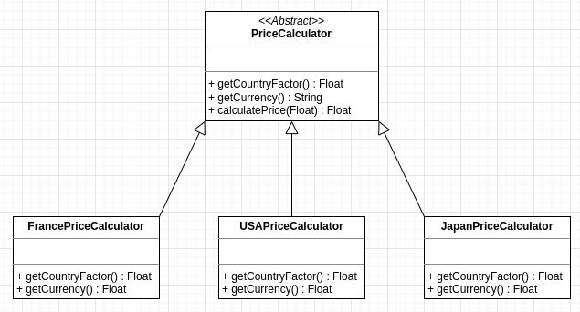

# **SAE R3.04 - Patrons de conceptions**
### **_Groupe 2-1_**
### _Mathieu Bergeron, Tom Freret, Sylvain Baudouin, Tomás Martineau, Fabien Nicou_


## **_Factory_**

Le patron de conception **"Factory"** est utilisé dans cet exemple avec la classe UserFactory, qui est une classe abstraite (déclarée avec le mot-clé abstract). La classe UserFactory définit une méthode abstraite makeUser() qui prend en paramètre un statut et renvoie un objet de type User.

Ce patron de conception permet de centraliser la logique de création des objets dans une seule et même classe (ici UserFactory), ce qui peut être utile lorsque la création de ces objets est complexe ou nécessite de nombreuses étapes. Cela permet également de rendre le code plus facile à maintenir et à modifier, car toutes les modifications à apporter à la création des objets peuvent être effectuées dans une seule et même classe.

## **_Strategy_**

Le patron de conception **"Strategy"** est également utilisé dans cet exemple, avec la classe abstraite UserStrategy qui définit une méthode abstraite loadView(). Les classes UserClient, UserResp et UserAdmin héritent de UserStrategy et définissent chacune leur propre implémentation de la méthode loadView().

Ce patron de conception permet de définir une stratégie de traitement pour chaque type d'objet (ici chaque type d'utilisateur), en encapsulant cette stratégie dans une classe dédiée. Cela permet de rendre le code plus modulaire et flexible, car il est possible de changer de stratégie de traitement en modifiant simplement la classe utilisée, sans avoir à modifier le reste du code.


## **_Decorator_**

Le patron de conception **"Decorator"** est utilisé dans cet exemple avec la classe abstraite FruitDecorator qui étend la classe FruitEntity (déclarée avec le mot-clé extends). La classe FruitDecorator sert de classe de base pour les classes FruitQuantity et FruitCommande, qui héritent de cette classe.

Le patron de conception "Decorator" permet de ajouter de nouvelles responsabilités à un objet de manière transparente, en enveloppant l'objet dans un autre objet qui possède ces responsabilités supplémentaires. Dans cet exemple, la classe FruitDecorator ajoute la responsabilité de stocker une quantité de fruits et un identifiant de commande à l'objet FruitEntity.

Les classes FruitQuantity et FruitCommande sont des exemples de classes "decorators" qui héritent de FruitDecorator et ajoutent ces responsabilités à l'objet FruitEntity. La classe FruitQuantity ajoute simplement la responsabilité de stocker une quantité de fruits, tandis que la classe FruitCommande ajoute également la responsabilité de stocker un identifiant de commande.

Le patron de conception "Decorator" permet de rendre le code plus modulaire et flexible, car il est possible d'ajouter de nouvelles responsabilités à un objet sans avoir à en modifier la classe de base. Cela peut être utile lorsque vous avez besoin d'ajouter de nouvelles fonctionnalités à un objet de manière dynamique, sans avoir à créer de nouvelles classes pour chaque combinaison de responsabilités.

## **_Template Method_**

### Utilité de la fonctionnalité
On utilise un template method pour nous permettre de calculer le prix de différents produits, et de récupérer la devise en fonction du pays dans lequel on se trouve. Cela permet une certaine dynamisation du site, tout en s'assurant que l'utilisateur ait la meilleure expérience possible sur le site.



_Schéma UML du Template Method_

### Pourquoi utiliser un template method ?

En utilisant un template method pour définir un algorithme de calcul de prix de base, avec des étapes spécifiques à chaque pays laissées à implémenter par des sous-classes, on peut s'assurer que tous les produits sont traités de manière homogène dans tous les pays. Cela facilite également les mises à jour futures en un seul endroit si les règles de calcul évoluent. De plus, ce template method est facilement extensible, on peut rajouter plus de pays si on souhaite étendre l'accesibilité du site, et il est facile de modifier les pays déjà éxistants.

```php
abstract class PriceCalculator {
	public function __construct() {
		if (static::class === PriceCalculator::class) {
			throw new TypeError("Cannot construct Abstract instances directly");
		}
	}

	abstract public function getCountryFactor();
	abstract public function getCurrency();

	public function calculatePrice($price) {
		return number_format($price * $this->getCountryFactor(), 2);
	}
}
```
```php
class FrancePriceCalculator extends PriceCalculator {
    public function getCountryFactor() {
        return 1;
    }
    public function getCurrency() {
        return "€";
    }
}

class UnitedKingdomPriceCalculator extends PriceCalculator {
    public function getCountryFactor() {
        return 0.88;
    }
    public function getCurrency() {
        return "£";
    }
}
```

### Comment ça marche ?

On a dans un premier lieu la classe abstraite _PriceCalculator_ qui définit deux méthodes abstraites, _getCountryFactor()_ et _getCurrency()_, ainsi que la méthode _calculatePrice(price)_ qui définit le calcul à faire pour obtenir le bon prix à partir du prix en paramètre, et de la valeur de retour de _getCountryFactor()_. Ensuite on a les différentes classes concrètes, qui héritent toutes de _PriceCalculator_, et qui définissent _getCountryFactor()_, méthode qui renvoie le taux de conversion de euro à la devise du pays, et _getCurrency()_, qui renvoie le symbole de la devise.
Pour pouvoir choisir quelle classe utiliser, on utilise une fonction qui nous permet de trouver le pays dans lequel on se trouve, et on utilise ensuite une fonction qui ressemble à une factory, qui en fonction du pays renvoie la bonne classe à utiliser.


